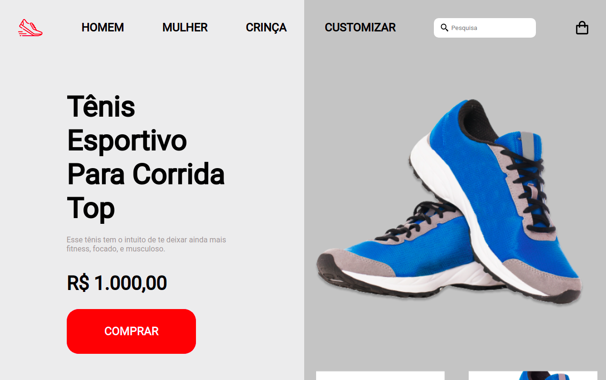

# RocketShoes

#### | Página principal

## 💻 **Tecnologias**

Esse projeto foi desenvolvido com essas tecnologias:

- [HTML](https://developer.mozilla.org/pt-BR/docs/Web/HTML)
- [CSS](https://developer.mozilla.org/pt-BR/docs/Web/CSS)
- [JavaScript](https://developer.mozilla.org/pt-BR/docs/Web/JavaScript)

---

## 🎨 **Layout**

Você pode visualizar o layout básico do projeto através desse [link](<https://www.figma.com/file/fuFhqQoBaTZaLqXJ29UIv0/DD-%2F-RocketShoes-(Copy)?node-id=0%3A1>)

---

## 🚀 **Projeto**

O projeto foi desenvolvido durante o curso Discover ​da Rocketseat.

E esse projeto pretende aprimora os conhecimentos adquirido durante os módulos:

- [O guia estelar de HTML](https://app.rocketseat.com.br/node/o-guia-estelar-de-html)

- [O guia estelar de CSS](https://app.rocketseat.com.br/node/o-guia-estelar-de-css)

- [Posicionando Foguetes](https://app.rocketseat.com.br/node/posicionando-foguetes)

- [Formulários de outro planeta](https://app.rocketseat.com.br/node/formularios-de-outro-planeta)

- [Alinhando os planetas](https://app.rocketseat.com.br/node/flexbox)

- [App bonito, até nos textos](https://app.rocketseat.com.br/node/app-bonito-ate-nos-textos)

- [Posso ver e ouvir o HTML](https://app.rocketseat.com.br/node/posso-ver-e-ouvir-o-html)

## :ringed_planet: **Desafio**

### Sobre o desafio:

- Neste desafio devemos desenvolver um mini e-commerce de calçados esportivos.

### Requisito para o desafio:

- Seguir o layout do Figma respeitando as medidas.
- O ponteiro do mouse deverá ter o comportamento de click nos menus, footer e nos botões da página.
- Adicionar um vídeo do youtube no local da imagem que representa um video.
- Deverá ter uma linha indicativa na foto que está aparecendo maximizada na galeria.
- Tornando o site responsivo(Falta fazer)
